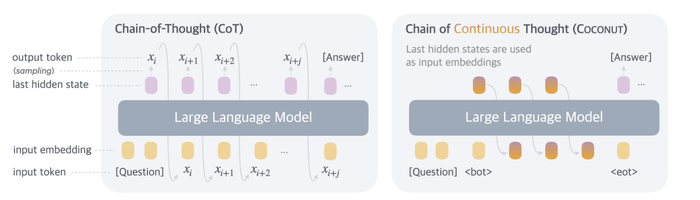
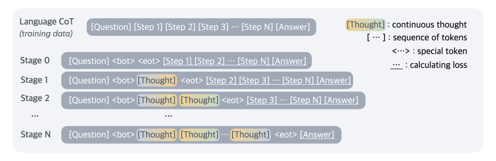
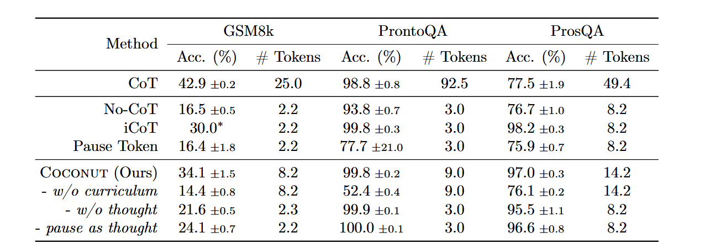

# Coconut：潜在空间中的LLM推理新范式

---

## 背景和动机

传统的LLMs通过生成自然语言形式的推理步骤（Chain-of-Thought）来解决问题，其存在一些问题。实际上，不同的特定问题推理时所需要花费的推理量相差很大，比如有些任务可能只需要简单的推理（例如直接匹配已知信息），而有些任务可能需要复杂的逻辑推理或上下文理解。然而现在的LLMs依然对其分配近乎同样大的计算投入。这意味着无论一个token需要多少推理量，模型都会花费相似的计算能力去预测它。这种设计可能导致资源浪费或效率低下。

除此之外，论文还引入了一些额外的证据，例如在神经学中，人类思考时脑部活跃的区域并不是语言区，以及人类语言更适合于沟通，而不是推理。

在推理链中，大多数token仅仅只是为了推理步骤的自然语言的流畅度，对实际推理过程的贡献很小，而剩下的那些少数的token则是推理的关键，这又往往需要更多的推理量。

先前有一些工作，比如用提示词工程让LLMs生成一些简短的思维链（Madaan和Yazdanbakhsh，2022），或者在生成那些关键token前，让LLMs执行额外的推理（Zelikman等，2024）。但是这些方法因为语言空间（Language Space）的限制，无法解决上述的问题。

因此理想的情况是让LLMs在脱离语言限制的情况下推理（但总要用语言传达给人类），在必要时将他们的推理结果转换为自然语言。

---

## 论文提出的方法

论文引入了一个虚构的新范式，称为Chain of Continuous Thought，翻译成中文为连续的思维链。

在传统的思维链中，模型生成中间步骤（即“思维链”）来逐步解决问题，在计算角度可以看作：

模型通过语言模型的头（LM Head）和嵌入层（Embedding Layer）将隐藏状态映射到语言空间，从而生成文本形式的推理过程

这句话如何理解？
我们可以将隐藏状态类比成模型的“内部语言”
LM Head：将模型的“内部语言”翻译成人类能理解的文本
Embedding Layer：将人类的文本（如中间推理步骤）翻译回模型的“内部语言”，即新的隐藏状态。
    
实际上呢？
隐藏状态是Transformer模型中每一层输出的高维向量（例如维度为4096或更大的浮点数数组），它们通过自注意力机制和前馈网络逐层传递，最终生成预测结果。
这些向量编码了输入文本的上下文信息（如词汇间关系、语法结构、语义关联等），是模型对输入数据的数学化抽象表示。
    
所以，
就像图左表示的一样：将每一层的隐藏状态作为嵌入层的输入，即为思维链中每一个思考步骤的数学形式化呈现。

而论文提出的Coconut直接将当前的最后一个隐藏状态作为下个阶段嵌入层的输入。其实就是将模型的推理过程隐式地在隐藏状态中传递，将最后的隐藏状态（也就是连续的思维链累计结果）输出。

论文中提到，这种连续的思维链范式能够同时编码多个潜在的下一步，从而实现类似于（BFS）广度优先搜索的推理过程。尽管模型最初可能无法做出正确的决策，但它可以在连续的思维中保留多种可能性，并通过推理逐步排除错误路径。

---

## 方法细节

以下是论文给出一些形式化定义。
 
 
对于输入序列 $x=(x_1,\dots,x_T)$，可以用一个标准大模型$\mathcal{M}$来进行如下表示：
$$
 H_t = \text{Transformer}(E_t)
$$
$$
\begin{align*}
\mathcal{M}(x_{t+1} \mid x_{\leq t}) = \text{softmax}(Wh_t)
\end{align*}
$$

其中， $E_t = [e(x_1), e(x_2), \dots, e(x_t)]$  表示到位置  $t$  为止的标记嵌入序列； $H_t \in \mathbb{R}^{t \times d}$  是到位置  $t$  为止所有标记的最后一个隐藏状态矩阵； $h_t$  是位置  $t$  的最后一个隐藏状态，即  $h_t = H_t[t, :]$ ； $e(·)$  是标记嵌入函数； $W$  是语言模型头部的参数。

对于输入序列 $x=(x_1,\dots,x_T)$，模型首先通过嵌入函数将每个离散标记转换为连续向量，形成嵌入序列 $E_t$ ,随后由Transformer模型处理生成隐藏状态矩阵 $H_t$ ，其中最后一个位置的隐藏状态 $h_t$ 被提取出来，并通过线性变换和softmax函数计算下一个标记 $x_{t+1}$ 的概率分布，完成自回归预测。

在图中可以看出，Coconut引入了两个特殊的标记`<bot>`和`<eot>`：

**`<bot>`**：标记潜在推理的起始位置（位置 `i`），触发模型进入“内部思考”模式。

**`<eot>`**：标记潜在推理的终止位置（位置 `j`），标志模型结束隐式推理并返回显式生成模式。

在 `i < t < j` 的时间步内，模型不再生成可见的中间文本，而是通过隐藏状态的连续演化完成推理。

在Coconut的“内部思考”模式中，潜在推理区间 `i < t < j` 的输入嵌入被替换成前一步的隐藏状态：

$$
E_t=[e(x_1),…,e(x_i),h_i,h_{i+1},\dots,h_{t−1}]
$$

可以看出 $e(x_{i+1})$ 的位置被前一步的隐藏状态 $h_{i}$ 所替代。

在“内部思考”模式结束后，将会恢复到普通的嵌入方式，即：

$$
E_t = [e(x_1), e(x_2), \dots, e(x_i), h_i, h_{i+1}, \dots, h_{j−1}, e(x_j), \dots, e(x_t)]
$$

---

## 实验

论文在三个推理任务上验证Coconut的有效性：

- 数学推理（GSM8k）：包含小学水平的数学应用题，需多步计算（如“约翰每年修剪草坪的费用”）。
- 逻辑推理（ProntoQA）：基于虚构概念的树状逻辑推理任务（如判断“Stella是否是floral”）。
- 复杂规划推理（ProsQA）：新提出的DAG结构问题，需模型在随机生成的有向无环图中规划路径（如“Tom是否是lempus”）。

论文对比了以下方法：

- CoT：生成显式语言推理链后输出答案。
- No-CoT：直接生成答案，无中间推理。
- iCoT：通过多阶段训练逐步内化CoT，最终直接生成答案。
- Pause Token：在输入中插入特殊<pause>标记，提供额外计算空间。

Coconut变体：
- w/o curriculum：直接使用最终阶段数据训练（无分阶段）。
- w/o thought：分阶段训练但禁用连续思维（类似iCoT）。
- pause as thought：用<pause>标记替代连续思维。

数学推理：Coconut优于iCoT和Pause Token，但弱于传统CoT（因GSM8k依赖显式计算步骤）。

逻辑推理：Coconut在ProntoQA和ProsQA上表现最佳，尤其在需要复杂规划的ProsQA任务中准确率显著提升（97.0% vs. CoT的77.5%）。

效率：Coconut生成token数远少于CoT（ProsQA：14.2 vs. 49.4），但略多于iCoT（因潜在推理需额外时间步）

---
原文链接：https://arxiv.org/abs/2412.06769