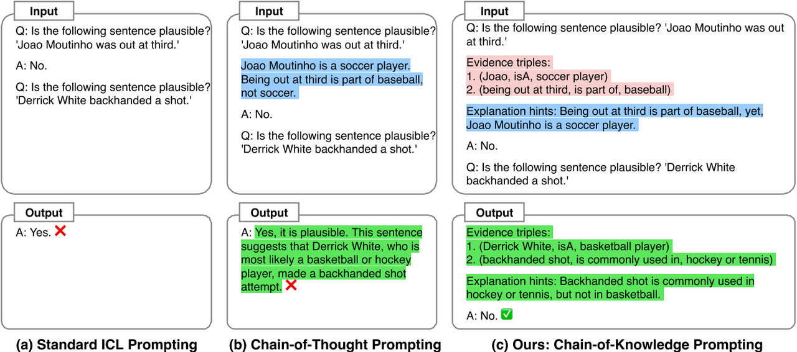
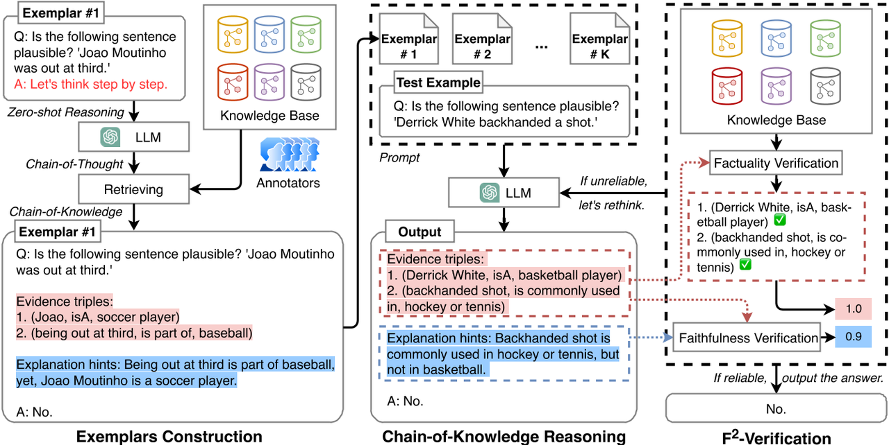
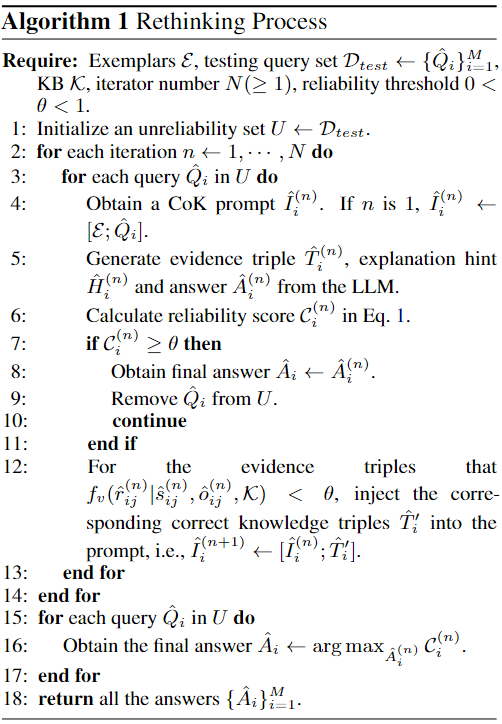

# Boosting Language Models Reasoning with Chain-of-Knowledge Prompting

## 论文概况

## 背景
近年来，"链式思维"提示技术（Chain-of-Thought，CoT）在复杂推理任务中取得了显著的成功，通过提供步骤式或带有合理解释的示例来引导大型语言模型（LLMs）生成中间推理步骤。然而，生成的推理链容易出现"幻觉"问题，即产生不符合事实的推理步骤，导致结论不准确。为了解决这一问题，提出了"知识链"提示（Chain-of-Knowledge，CoK）的方法，通过结构化的知识三元组来提供推理依据，提高推理链的可靠性和准确性。

## 现有问题
- 大模型存在幻觉，因此在进行推理链式的思考时，不能保证推理步骤的事实性和可信度，从而导致推理结果的错误。LLM 可能会强制生成符合 CoT 提示格式的文本基本原理，但在逻辑上模棱两可并达到错误的答案。

## 提出的方案
作者提出了一种新的"知识链"提示方法，通过生成明确的知识证据，利用知识图谱的三元组（如主语、关系、宾语）来支持LLMs的推理过程。同时引入了F2-验证策略来评估推理链的真实性和忠实性，以减少错误推理的发生。当模型的推理链被判定为不可靠时，可以通过提示模型重新思考，以生成更准确的推理。

## 案例简述比较分析

对于来自StrategyQA的查询"Is the following sentence plausible 'Derrick White backhanded a shot.'"，标准的in-context leaning(ICL)和Chain-of-Thought(CoT)，CoT方法虽然做到了一步一步的思考，但思考步骤中的真实性还是欠缺，CoT推理出Derrick White可能是棒球或者曲棍球手，最后得出了错误的判断，而CoK根据现有知识进行推理，得出正确答案。

# Chain-of-Knowledge(CoK)框架

## Chain-of-Knowledge Prompting
采用了知识库中三元组的概念，可以表达为"（subject，relation，object）"，以形式化推理链的显式证据。

- evidence triples（CoK-ET）
  - 结构化三元组，反映了从查询到答案所有推理所用到的事实证据。
- explanation hints（CoK-EH）
  - 对事实证据的文字解释。

## Examplars Construction
### 示例构建的挑战
- CoK prompting对于用结构化证据三元组构建文本依据的依赖性。
- 如何获得带注释的能更好表达文本依据的CoK-ET

### 构建过程
1. 选取示例：从六个领域构建一个Knowledge Base $$K$$ ，包括字典、常识、实体、事件、脚本和因果关系，形式为三元组
2. 生成解释提示：通过使用"let us think step by step"，利用零样本思维链生成每个问题的文字推理，这种解释提示帮助模型逐步分析问题，将复杂的推理分解为更易理解的步骤
3. 构建知识三元组：从外部知识库提取或生成结构化的知识三元组
4. 生成最终提示：将构建的只是三元组和解释提示结合在一起，形成一个任务特定的CoK提示，用于引导模型生成推理链

## F²-Verification
F²-Verification机制用于检查模型在生成推理链过程中是否出现了"幻觉"或不准确的推理，是验证模型推理链可靠性的方法，主要包括真实性（Factuality）和忠实性（Faithfulness）

- Factuality Verification
  - 精确验证
    - 对于已经存在的关系，直接验证其是否存在
  - 隐含验证
    - 对于不存在的关系，转化为图结构的补全任务，评估三元组的分数
- Faithfulness Verification
  - 利用 SimCSE 来计算已生成 explanation hint 和测试的 query，triples 及 answer 拼接而成的序列之间的相似度来评估忠实性

$$
f_u(\hat{H}_i | \hat{H}'_i = [\hat{Q}_i; \hat{T}_i; \hat{A}_i]) = \text{SimCSE}(\hat{H}_i, \hat{H}'_i)
$$

- 最后对于每个查询，都可以根据两种验证得分共同得出对应的分数 

$$
\begin{align*}
\mathcal{C}_i &= \gamma \frac{1}{|\hat{T}_i|} \sum_{j=1}^{|\hat{T}_i|} f_v(\hat{s}_{ij} | \hat{r}_{ij}, \delta_{ij}, \mathcal{K}) \\
&\quad + (1-\gamma) f_u(\hat{H}_i | \hat{H}'_i = [\hat{Q}_i; \hat{T}_i; \hat{A}_i]),
\end{align*}
$$

## Rethinking Algorithm
1. 设定信赖度阈值、最大迭代次数以及待选三元组集合
2. 将查询对应的 F²-verification 得分与阈值相比较，若高于阈值，则直接输出
3. 如果低于阈值，从待选三元组集合中选出一个相对得分最高的，加入到查询对应的三元组集合中，进行下一次迭代的检测
4. 如果迭代次数达到预设的上限时，直接输出答案

# 结论
通过广泛的实验，作者证明了知识链提示（CoK）方法在常识推理、事实推理、符号推理和算术推理任务中显著优于标准的链式思维提示方法。此外，结合F2-验证的CoK方法进一步提升了推理的准确性，验证了该方法在不同任务中的适用性和有效性(华东师范大学-利用知识链提示增强语言模型推理)。

# 一些问题
知识链中的三元组是大模型经过ICL以及Few-Shots进行推理得到的，而F²验证策略正是验证其三元组的真实性的方法。

原文链接：https://aclanthology.org/2024.acl-long.271.pdf