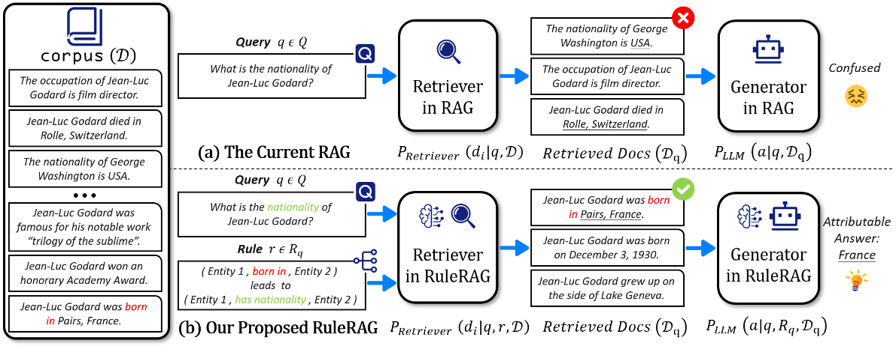
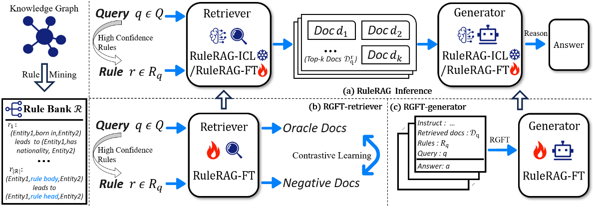

# RuleRAG: Rule-guided retrieval-augmented generation with language models for question answering

## 论文概况

### 背景
在知识密集型问答任务中，检索增强生成（RAG）框架通过从外部语料中检索内容并基于增强后的上下文生成答案。然而，现有方法仅考虑查询本身，没有为检索器指定检索偏好，或者指示生成器如何利用检索到的文档。因此，RAG框架在查询检索和回答生成的准确性上受到限制。

### 现有问题
- 检索器无法保证检索的有效性：
  - 在检索阶段，检索器无法保证召回的信息对于query而言，总是最相关和最有用的
- 大模型对检索文本的利用未深入：
  - 在生成阶段，现有RAG中的LLM并没有被具体地告知如何去正确利用冗杂的文本

### 提出的方案
作者提出了一种新的方法——规则引导的检索增强生成（RuleRAG），通过引入符号规则为上下文学习提供示例，以指导检索器和生成器。具体来说，该方法分为两部分：
1. RuleRAG-ICL（上下文学习）
2. RuleRAG-FT（微调）

## 案例简述比较分析

(a) Without the help of rules, the current RAG can only retrieve relevant documents at the shallow semantic level, rather than the overall semantics of the query, and thus get confused in answering.
1. 检索器只能从Query的语义层面进行类似于关键词匹配的检索
2. Query：What is the nationality of Jean-Luc Godard?
3. 检索词级(word-level)相似，也就是包括(Jean-Luc Godard/Nationality)的文本
4. 检索到不相关或相关但无用的信息，输出无法达到要求

RAG上限在于向量数据库中的信息，如果假设信息永远是有损的，那么RuleRAG将会有效。

(b)Guided by the rule$r
$related to the query, our proposed RuleRAG first retrieves supportive documents that are logically related to the query and then attributes the correct answer, "France".

1. 从Query $q$提取先验规则 Rule $r$
2. 利用 $q$ 和 $r$ 共同检索出相关文档
3. $P{_{LLM}}(a|q,R{_q},D{_q})$,将Query、检索到的文本、先验规则输入大模型进行生成

## QA Benchmarks的构建

### 1. 规则库
#### 1.1 实体关系
- 真实世界知识的合集，包括静态的事实（static facts）以及动态的事件（temporal events）
- 静态情景中，实体间会同时建立若干个不同的关系
- 时序情景中，实体间将在不同的时间戳上进行多次交互

#### 1.2 符号化规则
- 逻辑上若$r_1$（rule body）解释了$r_2$（rule head）的出现，则表达为以下自然语言格式
- $[Entity\,1,r_1,Entity\,2]\,leads\,to\,[Entity\,1,r_2,Entity\,2]$
- 将实体间出现的关系翻译为以上的文本格式
- 每一个单独的符号化规则构成了规则库

### 2. 测试集
#### 2.1 平衡实体分布
- 调整知识图谱中常见（popular）实体和长尾（long-tail）实体的数量，减少高流行实体数量
- 同时把长尾数据进行"增强"，操作是将涉及长尾实体的链接转换成测试的Query，将长尾实体作为对应的ground truth

### 3. 语料库和微调数据集
#### 3.1 语料库
- KG训练集中的实体、关系和事件线性连接为简洁、确切的事实的集合，是RuleRAG的检索源

#### 3.2 微调数据集
- 将KG分成两个不相交的部分，将Links转化为Query，分别为$F_R$和$F_G$
  - $F_R$用于检索器的微调
  - $F_G$用于生成器的微调

## RuleRAG架构

### RuleRAG-ICL
1. 首先根据查询 $q$ ，从规则库 $R$ 中匹配若干个对应规则 $r$ ，形成用于检索的规则集 $R_q$
2. RG-retriever分别检索所有的查询规则对 $(q,r)$
3. RG-generator在召回 $D_q$ 后，构建指令来提示大模型生成最终答案

### RuleRAG-FT
#### RGFT-retriever
- 论文使用了对比学习(contrastive learning objective)来更新LM encoder
- 主要利用了两种类型的检索器：
  - Sparse retriever by Pyserini
  - Dense retriever by the dual-encoder such as DPR and SimCSE

#### RGFT-generator
- Open-source LLMs
  - Few-shot
- Close-source LLMs
  - 3-shot替代微调

## 结论
实验结果表明，RuleRAG在多个知识图谱基准上的表现显著优于传统RAG框架。

## 一些问题
1. RuleRAG的具体工作流程中，rule body指向rule head，我们知道可以从初始查询中提取出rule head，但rule body后续该如何寻找、使用？
2. 在从查询到规则的提取时，有规定提取多少条规则吗，有限制吗？